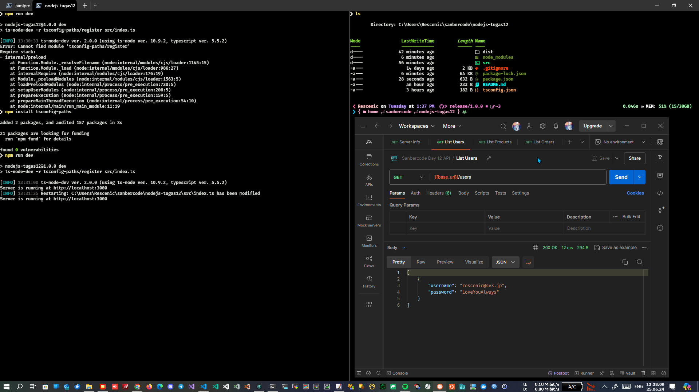
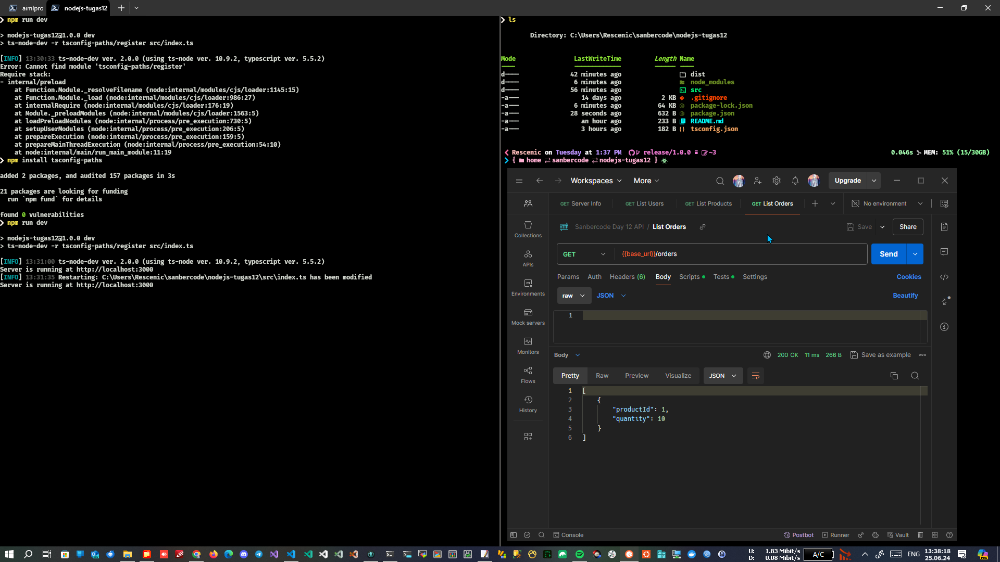

# Tugas 12 Sanbercode - Node.JS Backend

## Muhammad Ridwan Hakim

### Deploy Localhost

```bash
git clone https://github.com/rescenic/nodejs-tugas12.git

cd nodejs-tugas12

npm install

npm run build

npm start
```

### Import Sanbercode Day 12 API.postman_collection.json to Postman

### Screenshots

#### - List Users



#### - List Products


#### - List Orders


